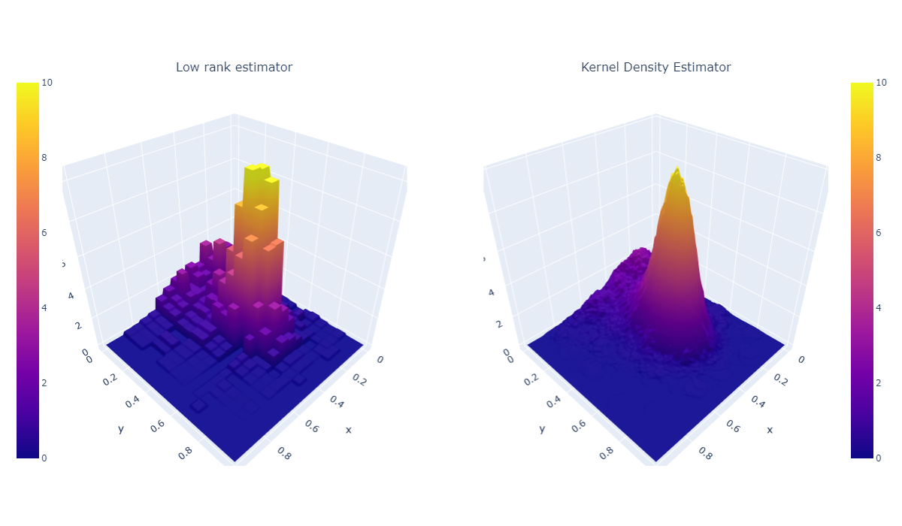

# Lowrankdensity

This Python package provides discrete and continuous **bivariate probability density estimators** under **low-rank constraints**. It introduces new histogram-type estimators that demonstrates faster convergence rates
under such constraints.
- In the discrete case, the density is represented as a low-rank matrix. 

- In the continuous case, the density is bivariate and Lipschitz-continuous over a compact rectangular support. It can also be decomposed as a sum of separable
functions $u_1,...u_K,v_1,...,v_K$ with $K$ the rank of the density function.

$$f(x,y) = \sum_{j=1}^K u_k(x)v_k(y)$$


<br>

The Lowrankdensity package contains three modules: 
- `lowrankdensity.datasets`: Generate low rank samples with a discrete or continuous distribution
- `lowrankdensity.models`: Estimate probability densities for discrete and continuous distributions and resample from the estimated distributions
- `lowrankdensity.viz`: Plot the estimated bivariate distributions 

### 00 - Colab Examples:
* Example on simulated data 🎯
[](https://colab.research.google.com/drive/1VdP1RUUqtP-2HDqNY0d0W5_dHb_PlSQM?usp=sharing)

## Installation

The library has been tested on Linux, MacOSX and Windows. It requires a C++ compiler for building/installing the EMD solver and relies on the following Python modules:

- Pandas (>=1.2)
- Numpy (>=1.16)
- Scipy (>=1.0)
- Scikit-learn (>=1.0)


#### Download Library ⚙️
You can install the toolbox through PyPI with:

```console
pip install Lowrankdensity
```

#### Import Library 📦
```python
import lowrankdensity
```

<br>

## Documentation

In the following examples, we will use low rank discrete and continuous samples generated by the functions in the `datasets` module.

### **01 - Discrete case**

#### 01.1 - Low rank discrete samples 
The `generate_lowrank_discrete(n_samples,K,d1,d2)` function samples bivariate data from a multinomial distribution using a low rank probability matrix
- `n_samples`: number of samples to generate 
- `K`: rank of probability matrix P
- `d1`, `d2`: number of classes in both variables

```python
from lowrankdensity.datasets._generate_samples import generate_lowrank_discrete

X1 = generate_lowrank_discrete(n_samples=5000,K=2,d1=10,d2=10)

```

<br>

#### 01.2 - Low rank probability matrix estimator

The `Discrete` class contains the discrete bivariate distribution estimator under low-rank constraints
- `.probability_matrix`: Get the estimated low-rank probability matrix of the distribution
- `.fit()`: Fit a discrete bivariate dataset to the model.
- `.sample(n_samples)`: Sample new data from the estimated distribution, with `n_samples` the number of samples to generate

```python
from lowrankdensity.models.discrete import Discrete

# Fit samples to the low rank Discrete model
model = Discrete(alpha=0.1) # alpha: level of precision of the estimation
model.fit(X1)

# Get the estimated probability matrix P
model.probability_matrix

# Generate new samples
new_samples1 = model.sample(n_samples=1000)
```

<br>

#### 01.3 - Plot bivariate discrete samples (with plotly)
The `viz` module contains two functions to visualize the distribution of newly sampled data from the discrete low rank estimator: `plot_2d_histogram()` to plot a two-dimensional histogram and `plot_2d_contour_histogram()` to plot a two-dimensional contour histogram.


```python
from lowrankdensity.viz._2Dhistogram import *

plot_2d_histogram(new_samples1, text_auto=True)
```


<br>
<br>


### **02 - Continuous case**

#### 02.1 - Low rank continuous samples 
The `generate_lowrank_continuous(n_samples,K)` function samples continuous data from a low rank joint density function $f(x,y)$
- `n_samples`: number of samples to generate
- `K`: rank of the distribution

```python
from lowrankdensity.datasets._generate_samples import generate_lowrank_continuous

X2 = generate_lowrank_continuous(n_samples=5000,K=2)
```

<br> 

#### 02.2 - Low rank density function estimator

The `Continuous()` class contains the continuous bivariate density estimator under low-rank constraints
- `.fit(X)`: Fit a continuous bivariate dataset to a density function estimator with `X` as a 2D array.
- `.density_function`: Estimated low rank density function 
- `.pdf(x,y)`: Compute the density function estimator f on two arrays `x` and `y`
- `.sample(n_samples)`: Sample new data from the density function estimator 


```python
from lowrankdensity.models.continuous import Continuous

# Get the density function estimator
model = Continuous(alpha=0.1) 
model.fit(X2)

# Compute the estimated density function on two 1D arrays
density_estimator = model.density_function

# Compute the estimated density function on two 1D arrays
x, y = np.linspace(0,1,100), np.linspace(0,1,100)
pdf_lowrank = model.pdf(x,y)

# Generate new samples from continuous estimator
new_samples2 = model.sample(n_samples=1000)
```

<br>

#### 02.3 - Plot bivariate continuous samples (with plotly)

The `viz` module contains two functions to visualize the bivariate density function from the continuous density estimator: `plot_3d_lowrank_density()` to plot the low rank density function in 3D and `plot_multiple_3d_densities()` to plot the low rank density with another estimator for comparison.

Here is an example using `plot_multiple_3d_densities()` and sklearn's `KernelDensity` class to plot the low rank density estimator against a KDE estimator.

```python
from sklearn.neighbors import KernelDensity

n = X_continuous.shape[0]
kde = KernelDensity(bandwidth=n**(-1/3), kernel="tophat")
kde.fit(X_continuous)

# Kernel Density estimator (kde) function
kde_estimator = lambda x,y: np.exp(kde.score_samples(np.array([[x,y]])))

# Compute kde function on x an y 
kde_mat = np.array([kde_estimator(i,j) for i in x for j in y]).reshape((len(x),len(y)))
```

```python
from lowrankdensity.viz._3Dsurfacedensity import plot_multiple_3d_densities

plot_multiple_3d_densities(continuous_model=model, # fitted low rank Continuous model
                           x=x, y=y, # x-axis and y-axis of the 3D plot
                           mat_estimator2=kde_mat, # matrice with KDE density computed on x and y
                           plot2_title="Kernel Density Estimator") # title of the plot
```




## Acknowledgements

Main contributors to the package:
- **Julien Chhor** (Harvard University, USA)
- **Olga Klopp** (ESSEC Business School, CREST, France)
- **Alexandre B. Tsybakov** (CREST, ENSAE, Institut Polytechnique de Paris, France)
- **Laurène David** (Hi! PARIS Engineering Team)
- **Gaetan Brison** (Hi! PARIS Engineering Team)
- **Shreshtha Shaurya** (Hi! PARIS Engineering Team)


## Contributions and code of conduct

Every contribution is welcome and should respect the [contribution guidelines](.github/CONTRIBUTING.md). Each member of the project is expected to follow the [code of conduct](.github/CODE_OF_CONDUCT.md).

## Support

You can ask questions and join the development discussion:

* On the structured-predictions [slack channel]()
* On the structured-predictions [gitter channel]()
* On the structured-predictions [mailing list]()

You can also post bug reports and feature requests in Github issues. Make sure to read our [guidelines](.github/CONTRIBUTING.md) first.

## References

[1] 
 
