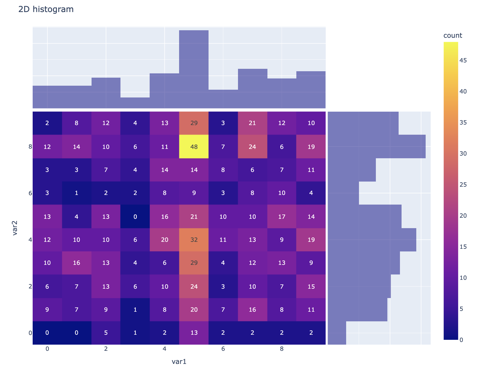

# LowRankDensity
In the present paper we incorporate rank constraint into density estimation problem. In the
discrete case, we assume that the density can be represented as a low-rank matrix. In the continuous case, we assume that the density is bi-variate and Lipschitz-continuous over a compact
rectangular support. Additionally, we assume that it can be decomposed as a sum of separable
functions. We introduce a new histogram-type estimator that demonstrates faster convergence
rates under such low-rank constraints. In the continuous case, our estimator converges in total
variation at the classical one-dimensional rate n
−1/3
, up to logarithmic factors. We also establish
lower bounds for the discrete and continuous problems, which confirm that our convergence rates
are minimax optimal (up to some additional logarithmic factors). Finally, we present efficient
algorithms for computing our estimators.

In this Package you can use 2 differents types of approaches:

* lowrankdensity.continuous
* lowrankdensity.discrete


## Installation

The library has been tested on Linux, MacOSX and Windows. It requires a C++ compiler for building/installing the EMD solver and relies on the following Python modules:

- Pandas (>=1.2)
- Numpy (>=1.16)
- Scipy (>=1.0)
- Scikit-learn (>=1.0)

### 00 Colab Examples:
* Example on simulated data 🎯
[](https://colab.research.google.com/drive/1VdP1RUUqtP-2HDqNY0d0W5_dHb_PlSQM?usp=sharing)


###  Discrete Case

####  01 - Download Library ⚙️

You can install the toolbox through PyPI with:

```console
pip install Lowrankdensity
```


#### 02 - Import Library 📦
```python
import lowrankdensity
```

#### 03 - Load example dataset 💽
```python
from lowrankdensity.datasets._generate_samples import generate_lowrank_discrete
X = generate_lowrank_discrete(n_samples=5000,K=2,d1=10,d2=10)
```

#### 04 - the Model ⚙️
```python
from lowrankdensity.models.discrete import *
# Fit samples to the low rank Discrete model
model = Discrete(alpha=0.1)
model.fit(X)

# Get the estimated probability matrix P
model.probability_matrix

# Generate new samples
new_samples = model.sample(n_samples=1000)
```

#### 05 - Visualization 📊
```python
from lowrankdensity.viz._2Dhistogram import *
plot_2d_histogram(new_samples,text_auto=True)

```


#### Congrats you made it 🎉


## Contributions and code of conduct

Every contribution is welcome and should respect the [contribution guidelines](.github/CONTRIBUTING.md). Each member of the project is expected to follow the [code of conduct](.github/CODE_OF_CONDUCT.md).

## Support

You can ask questions and join the development discussion:

* On the structured-predictions [slack channel]()
* On the structured-predictions [gitter channel]()
* On the structured-predictions [mailing list]()

You can also post bug reports and feature requests in Github issues. Make sure to read our [guidelines](.github/CONTRIBUTING.md) first.

## References

[1] 

[2] 

[3] 
